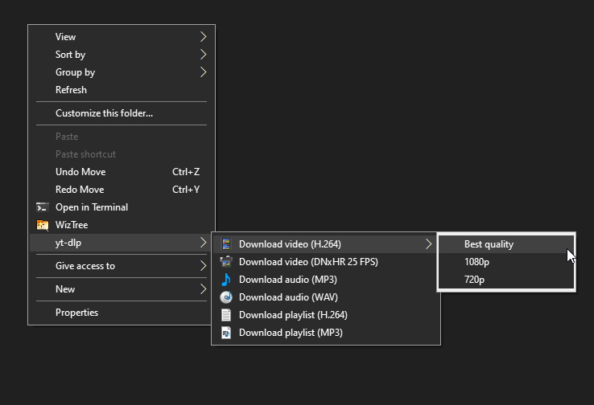
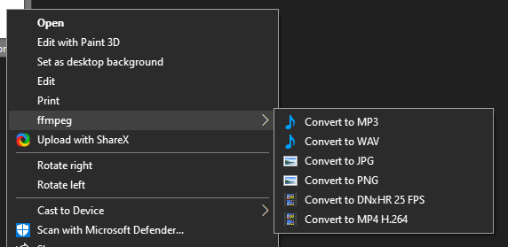

# youtube-dl and ffmpeg Windows Explorer Integration
[Download the latest version](https://github.com/noriaela/ytdl-explorer/archive/refs/heads/main.zip)

Download videos from YouTube/Twitch/Twitter and more (any platform that is supported by youtube-dl) right in the Windows Explorer, without installing any shady shareware apps!




### Supported formats:
* Audio: MP3, WAV
* Video: MP4 H.264, MOV DNxHR
* Image: PNG, JPG


### Quick Note:
If you're downloading things from Twitter I have the script grab cookies from firefox.

### How to use it
1. [Download the ZIP archive of this repository](https://github.com/noriaela/ytdl-explorer/archive/refs/heads/main.zip)
2. Unpack the archive
3. Double-click on the ytdl.reg file and confirm adding the keys to the registry
4. Copy the video link, go to the folder where you want to download it
5. Right click on the empty space and choose your option
6. Voilà!

This script requires **yt-dlp** and **ffmpeg**.
**To install [yt-dlp](https://github.com/yt-dlp/yt-dlp) and [ffmpeg](https://ffmpeg.org/):**

Open a PowerShell as Administrator and run:
```
Set-ExecutionPolicy RemoteSigned -Scope CurrentUser
irm get.scoop.sh | iex
scoop install yt-dlp ffmpeg
```

### Uninstalling ytdl-explorer
To uninstall the script, Double-click on the uninstall.reg file and confirm the changes.